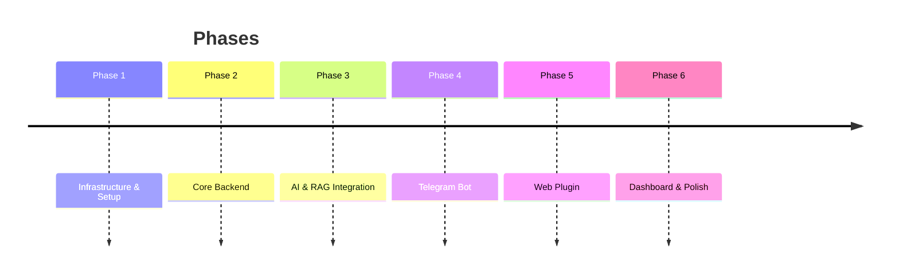
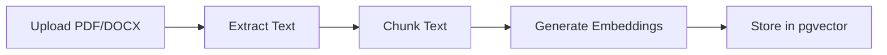

# 🎯 Roadmap: Hệ thống Trợ lý Ảo Giáo dục

## Tổng quan dự án



---

## Phase 1: Infrastructure & Setup ✅
**Timeline: Tuần 1**

- [x] Thiết kế kiến trúc hệ thống
- [x] Chuẩn bị Docker & Docker Compose
- [x] Cấu hình PostgreSQL + pgvector
- [x] Setup Flowise
- [ ] Cấu hình CI/CD pipeline (GitHub Actions)
- [ ] Setup monitoring (optional: Prometheus/Grafana)

**Deliverables:** Docker infrastructure ready to deploy

---

## Phase 2: Core Backend (.NET)
**Timeline: Tuần 2-3**

### 2.1 Project Structure
- [ ] Setup Clean Architecture layers
- [ ] Configure EF Core + PostgreSQL
- [ ] Setup AutoMapper, MediatR, FluentValidation

### 2.2 Authentication & Authorization
- [ ] JWT Authentication
- [ ] User registration/login
- [ ] Role-based access (Admin, User)

### 2.3 Core APIs
| API | Mô tả |
|-----|-------|
| `/api/auth/*` | Login, Register, Refresh token |
| `/api/users/*` | CRUD users |
| `/api/documents/*` | Upload, list, delete documents |
| `/api/chat/*` | Send message, get history |
| `/api/conversations/*` | List, get, delete conversations |

### 2.4 Document Management
- [ ] Upload PDF/DOCX endpoint
- [ ] File storage (local or S3)
- [ ] Document metadata tracking

**Deliverables:** Functional REST API with auth và document management

---

## Phase 3: AI & RAG Integration
**Timeline: Tuần 4-5**

### 3.1 Flowise Setup
- [ ] Tạo RAG chatflow trong Flowise
- [ ] Configure document loaders (PDF, DOCX)
- [ ] Setup text splitters
- [ ] Configure **Google Gemini Embeddings** (`text-embedding-004` hoặc `text-multilingual-embedding-002`)
- [ ] Setup pgvector as vector store
- [ ] Configure **Gemini LLM** (`gemini-2.0-flash` hoặc `gemini-1.5-pro`)

### 3.2 Document Processing Pipeline


- [ ] Tích hợp Flowise API từ .NET
- [ ] Auto-process documents khi upload
- [ ] Implement vector search

### 3.3 Conversational AI
- [ ] Context-aware responses
- [ ] Conversation memory
- [ ] Citation from source documents

**Deliverables:** Working RAG system answering từ documents

---

## Phase 4: Telegram Bot
**Timeline: Tuần 6**

### 4.1 Bot Setup
- [ ] Register bot với @BotFather
- [ ] Implement Telegram Bot API client
- [ ] Webhook endpoint trong .NET

### 4.2 Commands
| Command | Mô tả |
|---------|-------|
| `/start` | Welcome message |
| `/help` | Danh sách commands |
| `/ask <question>` | Hỏi AI trợ lý |
| `/history` | Xem lịch sử chat |
| `/clear` | Xóa lịch sử |

### 4.3 Features
- [ ] Text messaging
- [ ] Inline keyboard buttons
- [ ] File attachments (optional)
- [ ] Rate limiting

**Deliverables:** Fully functional Telegram bot

---

## Phase 5: Web Plugin (Chat Widget)
**Timeline: Tuần 7-8**

### 5.1 Widget Development
- [ ] Vue 3 chat component
- [ ] Responsive design
- [ ] Real-time messaging (WebSocket/SSE)
- [ ] Markdown rendering
- [ ] Code syntax highlighting

### 5.2 Embedding Script
```html
<!-- Embed anywhere -->
<script src="https://your-domain/widget.js"></script>
<script>
  AIAgent.init({ apiKey: 'xxx', theme: 'light' })
</script>
```

- [ ] Create embeddable JS bundle
- [ ] Customizable themes
- [ ] Configuration options

### 5.3 Features
- [ ] Typing indicators
- [ ] Message history persistence
- [ ] File upload support
- [ ] Mobile responsive

**Deliverables:** Embeddable chat widget

---

## Phase 6: Dashboard & Polish
**Timeline: Tuần 9-10**

### 6.1 Admin Dashboard
- [ ] Login/Authentication
- [ ] User management
- [ ] Document management UI
- [ ] Analytics dashboard
- [ ] Conversation logs

### 6.2 Analytics
- [ ] Total conversations
- [ ] Messages per day/week
- [ ] Popular questions
- [ ] Response time metrics

### 6.3 Final Polish
- [ ] Error handling
- [ ] Loading states
- [ ] Documentation
- [ ] Testing
- [ ] Security audit

**Deliverables:** Complete admin dashboard

---

## Tech Stack Summary

| Layer | Technology |
|-------|------------|
| **Backend** | .NET 10, EF Core, MediatR |
| **AI** | Flowise, LangChain, **Google Gemini** |
| **Embeddings** | Gemini `text-embedding-004` |
| **Database** | PostgreSQL + pgvector |
| **Frontend** | Vue 3, TypeScript, Vite |
| **Messaging** | Telegram Bot API |
| **Infra** | Docker, Docker Compose |

---

## Ước tính Timeline

| Phase | Thời gian | Status |
|-------|-----------|--------|
| Phase 1 | Tuần 1 | ✅ Done |
| Phase 2 | Tuần 2-3 | ⏳ Next |
| Phase 3 | Tuần 4-5 | ⬜ |
| Phase 4 | Tuần 6 | ⬜ |
| Phase 5 | Tuần 7-8 | ⬜ |
| Phase 6 | Tuần 9-10 | ⬜ |

**Tổng thời gian ước tính: 10 tuần**

---

## Next Steps

1. **Ngay bây giờ:** Copy `.env.example` → `.env` và điền credentials
2. **Tiếp theo:** Bắt đầu Phase 2 - xây dựng Core Backend APIs
3. **Song song:** Thiết kế database schema chi tiết
